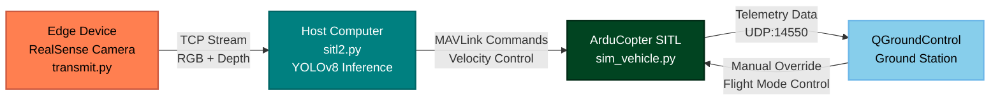

# Autonomous Drone Person Tracking Simulation

A real-time person tracking system using Intel RealSense depth camera, YOLOv8 object detection, and ArduCopter SITL simulation. The system streams RGB and depth data from an edge device to a host computer for AI inference and autonomous drone control.

[](https://www.youtube.com/watch?v=UPli5mhJNV0)

## System Overview




**Components:**
- `transmit.py` - Edge device streaming RGB/depth data via TCP
- `sitl2.py` - Host computer receiving streams, running YOLOv8 inference, sending MAVLink commands  
- `sim_vehicle.py` - ArduCopter SITL simulation
- QGroundControl - Ground control station for monitoring

## Prerequisites

**Hardware:**
- Intel RealSense Camera D455
- An edge device (A device which will be connected to drone later)
- One Host computer for doing Object detection Inference

**Software:**
- Python 3.8+
- ArduPilot SITL 
- QGroundControl

## Usage Instructions

### Step 1: Start ArduCopter SITL
```
cd ~/ardupilot/ArduCopter
python3 ~/ardupilot/Tools/autotest/sim_vehicle.py -v ArduCopter --out=udp:127.0.0.1:5760
```

### Step 2: Configure QGroundControl
1. Launch QGroundControl
2. Connect to vehicle (should auto-connect to UDP:14550)
3. **Set flight mode to GUIDED** (critical step)
4. Verify telemetry is working

### Step 3: Start Edge Device (RealSense Streaming)
```
# On edge device - modify TCP_IP in transmit.py first
python transmit.py
```

**Configuration in transmit.py:**
```
TCP_IP = "172.16.13.97"  # Change to your host computer IP
TCP_PORT = 5005
```

### Step 4: Start Host Computer (Inference & Control)
```
# On host computer
python sitl2.py
```

## Key Configuration Parameters

| File | Parameter | Description | Default |
|------|-----------|-------------|---------|
| `transmit.py` | `TCP_IP` | Host computer IP address | `"172.16.13.97"` |
| `transmit.py` | `TCP_PORT` | Streaming port | `5005` |
| `sitl2.py` | `MIN_DEPTH` | Minimum tracking distance (m) | `0.5` |
| `sitl2.py` | `MAX_DEPTH` | Maximum tracking distance (m) | `10.0` |
| `sitl2.py` | MAVLink connection | SITL connection string | `'udp:127.0.0.1:5760'` |

## System Behavior

**Tracking Logic:**
- Detects persons using YOLOv8
- Calculates distance using depth data
- Maintains 2-3 meter following distance
- Lateral movement based on person's position in frame
- Automatic landing when tracking is lost

**Speed Control:**
- Distance > 3m: Forward speed 1.5 m/s
- Distance 2-3m: Forward speed 1.0 m/s  
- Distance 


## Technical Details

**Stream Format:**
- RGB: 320x240 JPEG compressed
- Depth: 320x240 16-bit unsigned integers
- Protocol: TCP with length-prefixed messages

**MAVLink Commands Used:**
- `MAV_CMD_COMPONENT_ARM_DISARM` - Arm/disarm motors
- `MAV_CMD_DO_SET_MODE` - Set GUIDED mode
- `MAV_CMD_NAV_TAKEOFF` - Autonomous takeoff
- `MAV_CMD_NAV_LAND` - Autonomous landing
- `SET_POSITION_TARGET_LOCAL_NED` - Velocity control


## **Contributors**


